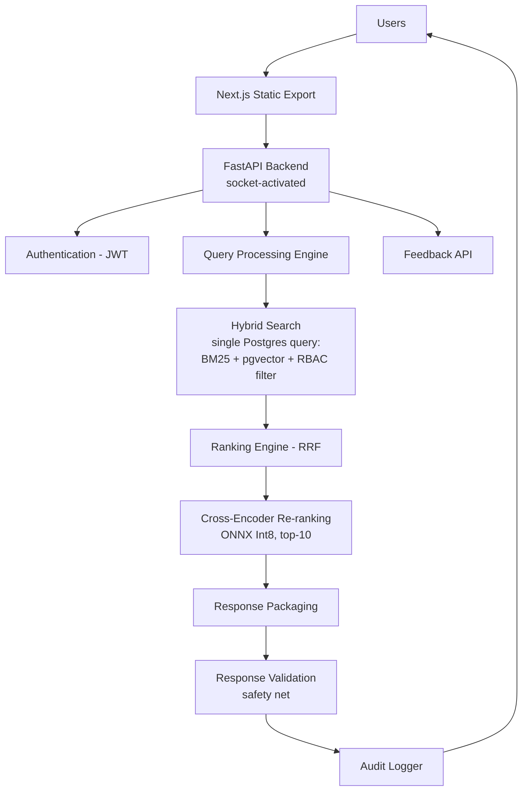
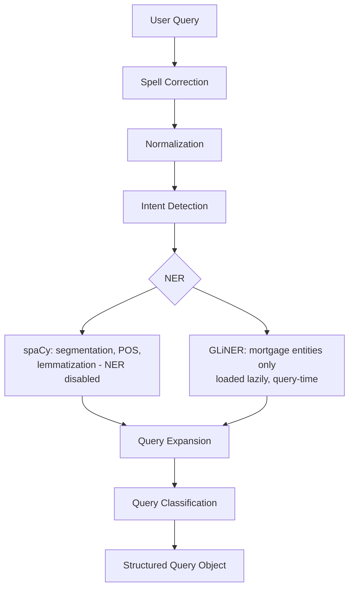
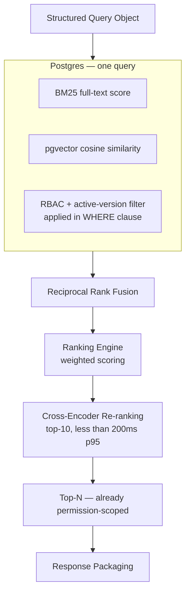
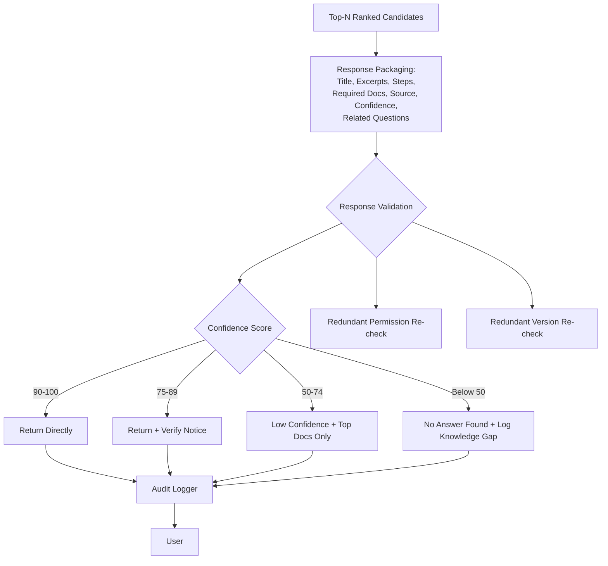
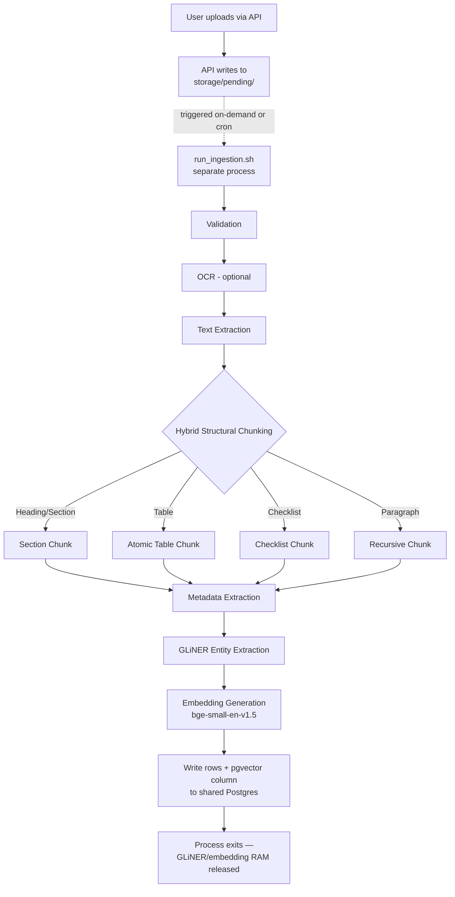
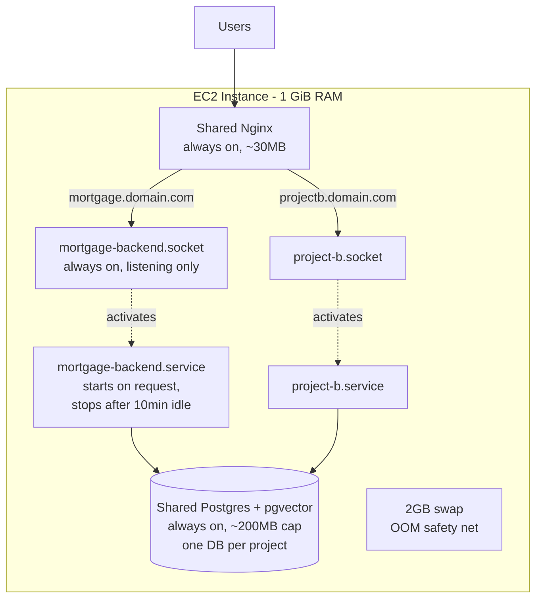
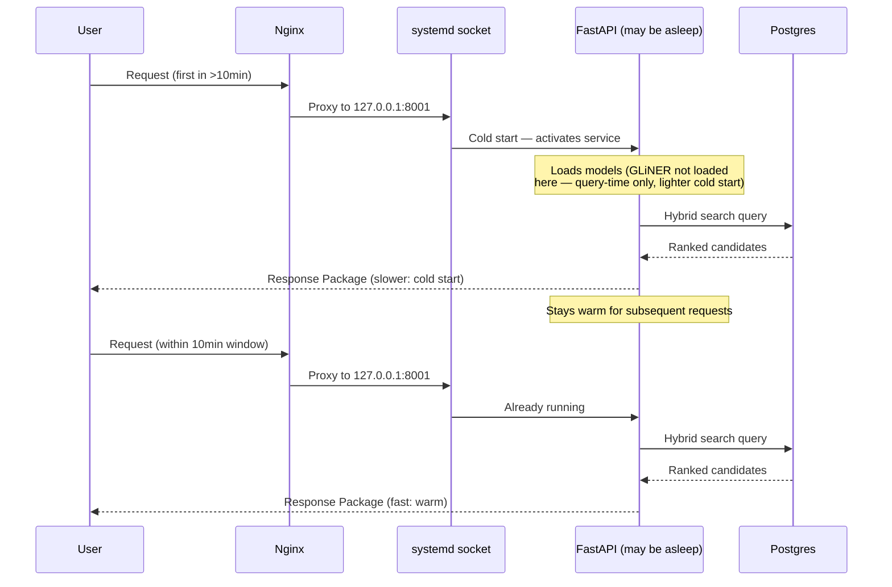

# Mortgage CRM Intelligent Knowledge Assistant — Final System Design (V3.2)

Consolidates the retrieval architecture (V3.1) and the shared-host
infrastructure decisions (V3.2 addendum) into one authoritative design
doc. Companion to `Final_Folder_Structure.md` and `Final_Tech_Stack.md`.

---

## 1. Design Philosophy

**"Find the right information, don't generate new information."**

No LLM anywhere in the pipeline. Every field in a response is retrieved,
never synthesized — this is the basis of the no-hallucination,
audit-friendly compliance story, and it constrains every design decision
below.

---

## 2. Full Request Flow (Application Layer)

```
                              USERS
                                │
                                ▼
                  Next.js Static Export + Shadcn/UI
                     (calls FastAPI directly — no BFF)
                                │
                                ▼
              FastAPI Backend (socket-activated, on-demand)
                                │
        ┌───────────────────────┼────────────────────────┐
        ▼                       ▼                        ▼
 Authentication           Query Processing         Feedback API
      (JWT)                     │
                                ▼
                    Query Processing Engine
        • Spell Correction  • Normalization  • Intent Detection
        • spaCy (segmentation/POS/parsing)  • GLiNER (mortgage entities)
        • Query Expansion   • Classification
                                │
                                ▼
        Hybrid Search Engine — single Postgres query
        • BM25 (full text)  • pgvector (cosine similarity)
        • RBAC + active-version metadata pre-filter
                                │
                                ▼
                  Ranking Engine (Reciprocal Rank Fusion)
        40% Semantic / 30% BM25 / 15% Metadata / 10% Feedback / 5% Freshness
        (initial default weights — tuned via Evaluation Framework)
                                │
                                ▼
              Cross-Encoder Re-ranking (ONNX Int8, top-10 candidates)
                     Latency budget: <200ms p95
                                │
                                ▼
                       Response Packaging
        Title • Matched Excerpts • Steps • Required Documents
        Source/Page/Section • Confidence Score • Related Questions
                                │
                                ▼
              Response Validation (redundant safety net)
        • Confidence-based routing  • Permission re-check
        • Active-version re-check
                                │
                                ▼
                     Audit Logger (every request)
                                │
                                ▼
                              USERS
```



---

## 3. Query Processing Engine — Detail



---

## 4. Hybrid Search — Now a Single Postgres Query

The biggest structural change from V3.1: BM25, vector similarity, and
RBAC/version filtering are no longer three separate systems fused in
application code — they're one SQL query against the shared Postgres
instance.

```sql
-- Illustrative shape, not final SQL
SELECT chunk_id, content, source_doc_id,
       ts_rank(bm25_vector, query) AS bm25_score,
       1 - (embedding <=> :query_embedding) AS semantic_score
FROM document_chunks
WHERE is_active = true
  AND is_approved = true
  AND department = ANY(:user_allowed_departments)   -- RBAC pre-filter
ORDER BY (embedding <=> :query_embedding)
LIMIT 50;
```



**Why the pre-filter placement still matters even in one query:** the
`WHERE` clause excludes restricted/inactive rows before ranking or
reranking ever sees them — same principle as V3.1, now enforced by the
database itself rather than an application-layer filter step.

---

## 5. Response Packaging + Validation



Confidence thresholds (90/75/50) are initial defaults, tuned via the
Evaluation Framework — not fixed constants.

---

## 6. Document Ingestion — Decoupled Batch Pipeline

Ingestion runs as its own process (`run_ingestion.sh`), never inside the
always-on API process. GLiNER, spaCy, and the embedding model are the
heaviest components in the stack; loading them only for the duration of
a batch job means that memory is released back to the OS when the job
ends, instead of being held 24/7.



---

## 7. Shared-Host Deployment Architecture



At idle, only Nginx (~30MB) and Postgres (~200MB cap) are resident —
roughly 230MB baseline. Individual project backends wake on traffic and
sleep after 10 minutes idle, which is what makes multiple projects
coexist on 1 GiB — not smaller per-project footprints, but zero
footprint while idle.

---

## 8. End-to-End Sequence (Cold Start vs. Warm)



---

## 9. Component Responsibility Summary

| Component | Responsibility | Enforcement / Lifecycle |
|---|---|---|
| Query Processing Engine | Clean and structure the raw query | Always-on, lightweight |
| Hybrid Search (Postgres + pgvector) | Retrieve candidates; **enforce RBAC + active-version filtering in the WHERE clause** | Primary enforcement point |
| Ranking Engine (RRF) | Fuse BM25 + semantic scores with metadata/feedback/freshness | Post-filter |
| Cross-Encoder Reranker | Precision-rank top-10 candidates (not generative) | Post-RRF, <200ms p95 |
| Response Packaging | Assemble retrieved content into a structured package | Post-rank |
| Response Validation | Redundant safety-net check; confidence-based routing | Last-mile, non-primary for permissions |
| Audit Logger | Immutable record of every query | Every request |
| Evaluation Framework | Measure retrieval quality on every ranking/weight/threshold change | CI-gated |
| Ingestion Batch Pipeline | OCR, chunking, entity/embedding extraction | On-demand, non-resident |
| Systemd Socket/Service | On-demand backend activation | Idle-stopped after 10 min |
| Shared Postgres + Nginx | Cross-project shared infra | Always-on, capped memory |

---

## 10. Key Design Decisions (Rationale)

1. **No generation anywhere.** "Answer" → "Response Package"; every field
   is retrieved, never synthesized.
2. **RBAC/version filtering is a pre-filter, in the database WHERE
   clause**, not a late validation gate — closes both a security gap and
   avoids wasted reranking compute.
3. **pgvector replaces Qdrant.** One database process instead of two;
   BM25 + vector + RBAC filtering collapse into a single SQL query.
4. **Redis and MinIO dropped for MVP.** Neither is a hard dependency;
   both can be reintroduced once real traffic justifies the RAM cost.
5. **Ingestion is decoupled from the API process.** GLiNER and the
   embedding model are the heaviest components — they run only for the
   duration of a batch job, never resident 24/7.
6. **Backend is socket-activated and idle-stopped**, not always running.
   This — not per-service tuning — is what makes multiple projects
   coexist on 1 GiB RAM.
7. **Reranking latency (<200ms p95) and cold-start latency are both
   tracked as explicit metrics** in the Evaluation Framework, not
   assumptions.
8. **Ranking weights and confidence thresholds are configuration**,
   documented as initial defaults, expected to shift based on benchmark
   results.
9. **Audit logging is separate from analytics** — compliance artifact,
   immutable, per-query.
10. **CPU credit contention across shared-host projects is a known,
    unsolved risk** — tracked via a dedicated Grafana dashboard, not
    mitigated by this architecture. A project needing consistent low
    latency should move to its own instance.
