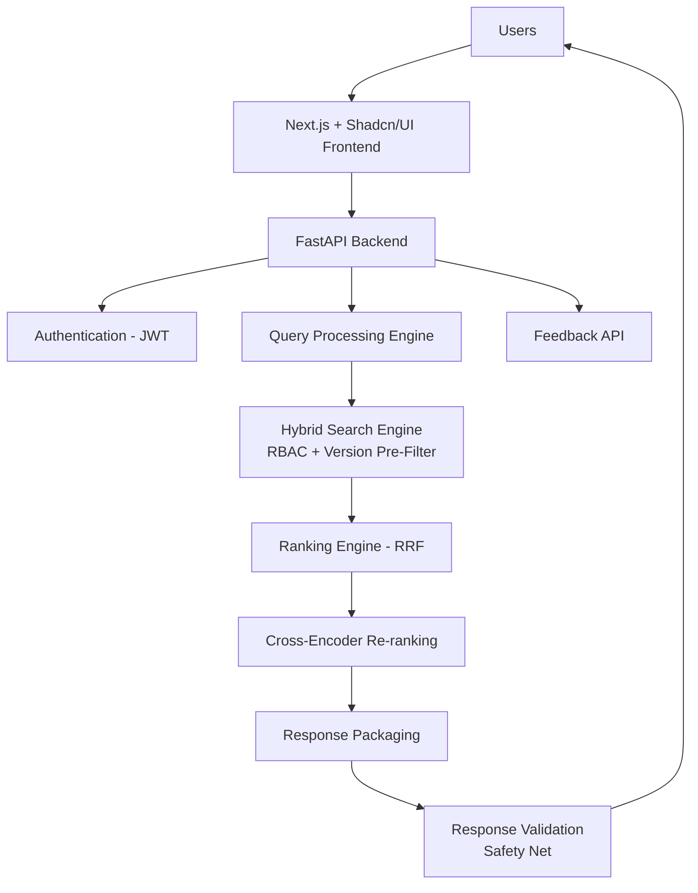
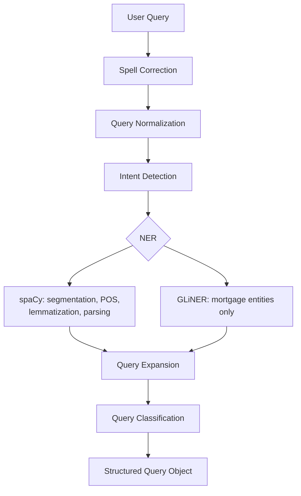
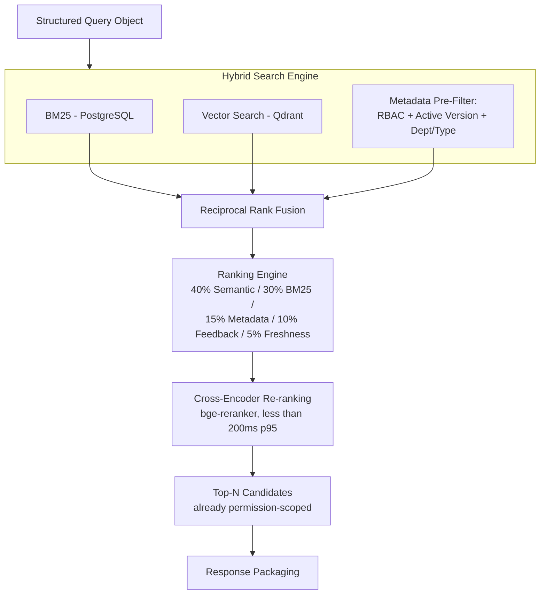
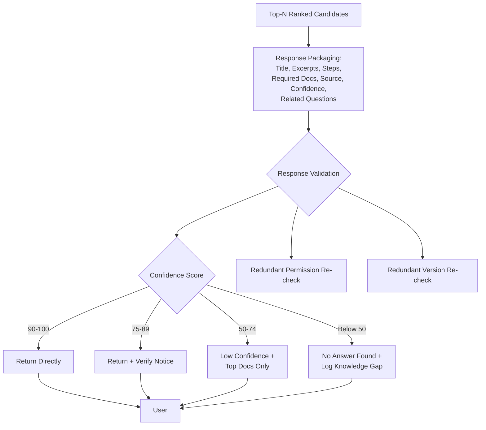
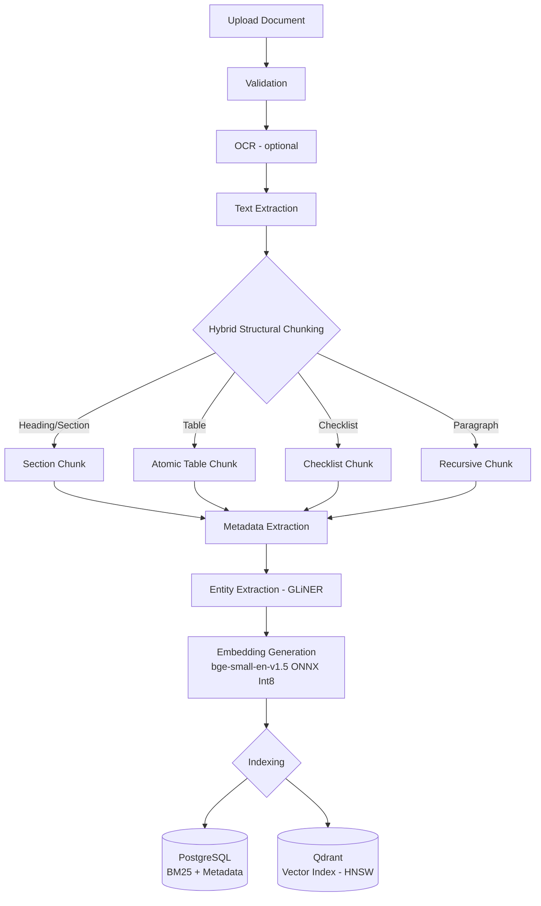
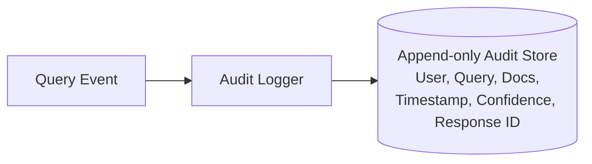
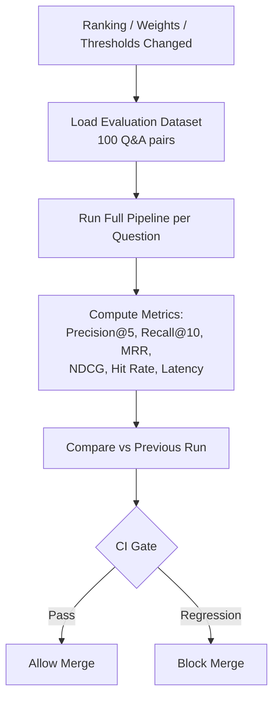
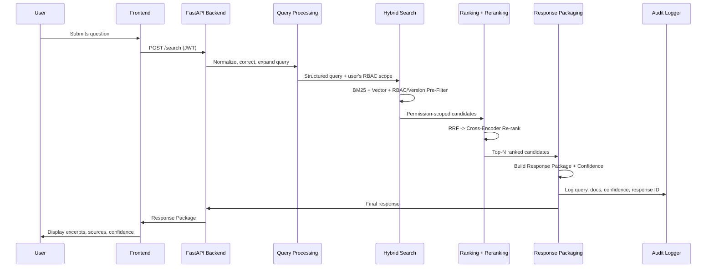

# Mortgage CRM Intelligent Knowledge Assistant — System Design (V3.1)

Companion document to `Project_Folder_Structure.md`. Covers system architecture, data flow, and each major subsystem, with flowcharts in both ASCII (readable anywhere) and Mermaid (renders in GitHub, VS Code, Obsidian, etc.).

---

## 1. High-Level System Architecture

```
                              USERS
                                │
                                ▼
                  Next.js + Shadcn/UI Frontend
                                │
                                ▼
                         FastAPI Backend
                                │
        ┌───────────────────────┼────────────────────────┐
        ▼                       ▼                        ▼
 Authentication           Query Processing         Feedback API
      (JWT)                     │
                                ▼
                    Query Processing Engine
                                │
                                ▼
        Hybrid Search Engine (RBAC + version pre-filter)
                                │
                                ▼
                        Ranking Engine (RRF)
                                │
                                ▼
                  Cross-Encoder Re-ranking Stage
                                │
                                ▼
                       Response Packaging
                                │
                                ▼
              Response Validation (safety-net)
                                │
                                ▼
                              USERS
```



---

## 2. Query Processing Engine — Detail

```
User Query
    │
    ▼
Spell Correction (RapidFuzz / SymSpell)
    │
    ▼
Query Normalization
    │
    ▼
Intent Detection
    │
    ▼
Named Entity Recognition
    ├── spaCy: segmentation, tokenization, lemmatization, POS, dependency parsing
    └── GLiNER: mortgage entities only (Lender, Product, Document, Property, Case #, Client)
    │
    ▼
Query Expansion (Synonym Dictionary)
    │
    ▼
Query Classification
    │
    ▼
Structured Query Object → passed to Hybrid Search Engine
```



---

## 3. Hybrid Search + Ranking + Reranking Flow

This is the core change from V3: **RBAC and active-version filtering happen at the metadata-filter step, before ranking or reranking touch the candidate set** — not as a late validation gate.

```
Structured Query Object
    │
    ▼
┌─────────────────────────────────────────────┐
│           Hybrid Search Engine               │
│                                               │
│  BM25 (PostgreSQL) ──┐                       │
│  Vector Search (Qdrant) ─┤                    │
│  Metadata Pre-Filter:                         │
│    • RBAC (user's permission scope)           │
│    • Active/Approved version only             │
│    • Department / doc-type filters             │
└─────────────────────────────────────────────┘
    │
    ▼  (candidate set — already permission-scoped)
Reciprocal Rank Fusion (RRF)
    │
    ▼
Ranking Engine
  40% Semantic Score  |  30% BM25  |  15% Metadata
  10% Feedback        |  5% Freshness
  (Initial Default Weights — tuned via Evaluation Framework)
    │
    ▼
Cross-Encoder Re-ranking (bge-reranker-base/small)
  Latency budget: <200ms p95
    │
    ▼
Top-N ranked, permission-safe candidates → Response Packaging
```



---

## 4. Response Packaging + Validation Flow

```
Top-N Ranked Candidates
    │
    ▼
Response Packaging
  • Title
  • Matched Excerpt(s)          [retrieved, never generated]
  • Relevant Steps
  • Required Documents
  • Source Document / Page / Section
  • Confidence Score
  • Related Questions
    │
    ▼
Response Validation (redundant safety-net, not primary enforcement)
    │
    ├── Confidence threshold check
    │     90-100  → return directly
    │     75-89   → return + "verify with cited source" notice
    │     50-74   → low-confidence + top docs only
    │     <50     → no answer found + log Knowledge Gap
    │
    ├── Redundant permission re-check
    └── Redundant active-version re-check
    │
    ▼
Final Response → User
```



---

## 5. Document Ingestion Pipeline

```
Upload Document
    │
    ▼
Validation (file type, size, malware scan)
    │
    ▼
OCR (optional — Tesseract, for scanned docs)
    │
    ▼
Text Extraction
    │
    ▼
Hybrid Structural Chunking
    ├── Heading/Section  → Section chunk
    ├── Table            → Atomic chunk (never split mid-table)
    ├── Checklist         → Checklist chunk
    └── Paragraph/prose  → Recursive chunking
    │
    ▼
Metadata Extraction (version, approval status, department, doc type)
    │
    ▼
Entity Extraction (GLiNER)
    │
    ▼
Embedding Generation (FastEmbed + bge-small-en-v1.5, ONNX Int8)
    │
    ▼
Indexing
    ├──────────► PostgreSQL (BM25 index + metadata)
    └──────────► Qdrant (vector index, HNSW)
```



---

## 6. Audit Logging Flow

```
Any Query Event
    │
    ▼
Audit Logger (separate from analytics)
  • User
  • Query
  • Retrieved Documents
  • Timestamp
  • Confidence Score
  • Response ID
    │
    ▼
Append-only Audit Store (PostgreSQL — separate table/schema, write-once)
```



---

## 7. Evaluation Framework Flow

```
Ranking / Weights / Thresholds Changed
    │
    ▼
Load Evaluation Dataset (100 questions, expected doc, expected chunk)
    │
    ▼
Run Full Pipeline for Each Question
    │
    ▼
Compute Metrics
  • Precision@5
  • Recall@10
  • MRR
  • NDCG
  • Hit Rate
  • Latency (incl. reranker p95)
    │
    ▼
Compare vs. Previous Benchmark Run
    │
    ▼
Pass/Fail Gate in CI (eval_on_pr.yml) → block merge if regression
```



---

## 8. End-to-End Sequence (Single Query Request)



---

## 9. Component Responsibility Summary

| Component | Responsibility | Enforcement Point |
|---|---|---|
| Query Processing Engine | Clean and structure the raw query | Pre-search |
| Hybrid Search Engine | Retrieve candidates; **enforce RBAC + active-version filtering** | **Primary enforcement — before ranking** |
| Ranking Engine (RRF) | Fuse BM25 + semantic scores with metadata/feedback/freshness | Post-filter |
| Cross-Encoder Reranker | Precision-rank top candidates (not generative) | Post-RRF |
| Response Packaging | Assemble retrieved (not generated) content into a structured package | Post-rank |
| Response Validation | Redundant safety-net check; confidence-based response routing | Last-mile, non-primary for permissions |
| Audit Logger | Immutable record of every query for compliance | Every request |
| Evaluation Framework | Measure retrieval quality on every ranking/weight/threshold change | CI-gated |

---

## 10. Key Design Decisions (Rationale)

1. **RBAC/version filtering is a pre-filter, not a post-filter.** Prevents wasted reranking compute on inaccessible documents and avoids restricted content passing through ranking/logging layers before being excluded.
2. **No generation anywhere in the pipeline.** "Answer" was replaced with "Response Package" — every field is retrieved, never synthesized, which is the basis of the no-hallucination compliance story.
3. **Reranking latency is a hard constraint (<200ms p95), not an assumption.** Cross-encoders are more expensive than vector search; this is tracked in the Evaluation Framework's latency metric, not discovered later under load.
4. **Ranking weights and confidence thresholds are configuration, not code.** Both start as documented defaults and are expected to shift based on the Evaluation Framework's output — never frozen without a benchmark run behind the change.
5. **Audit logging is separate from analytics.** Audit records are compliance artifacts (immutable, per-query) — analytics dashboards are for product/UX insight and can be more mutable/aggregated.
